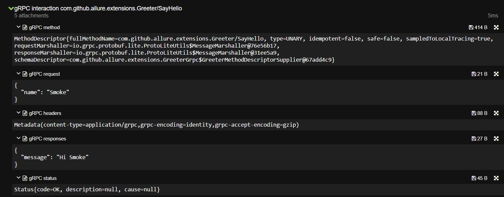

# allure-grpc
[](http://www.opensource.org/licenses/MIT)
[](https://github.com/diffplug/spotless)
[](https://github.com/spotbugs/spotbugs)
[](https://a-simeshin.github.io/allure-grpc/)

Lightweight gRPC interceptors to attach integration data into Allure reports

## Client interceptor
The client interceptor designed to attach maximum of useful integration data from the gRPC client to Allure, that
could be helpful to visually display possible problems that occur in tests without repeated broken or failed tests on
CI. Supports unary and stream interactions. Interceptor converts and formats messages from proto to more readable json
format by default.



## Usage

### [grpc-java](https://github.com/grpc/grpc-java)
For additional examples look at [grpc-java examples](https://github.com/grpc/grpc-java/blob/012dbaf5be3fb0d532d977d288a0e42a58f30a7c/examples/src/main/java/io/grpc/examples/header/CustomHeaderClient.java#L45)
```java
    YourServiceGrpc.YourServiceBlockingStub yourServiceBlockingStub = YourServiceGrpc.newBlockingStub(
        ManagedChannelBuilder.forAddress(host, port)
            .intercept(new AllureGrpcClientInterceptor())
            .build()
    );
```
for in-process client-server interaction
```java
    YourServiceGrpc.YourServiceBlockingStub yourServiceBlockingStub = YourServiceGrpc.newBlockingStub(
        InProcessChannelBuilder.forName("testing")
            .intercept(new AllureGrpcClientInterceptor())
            .build()
    );
```
<br>

### [grpc-spring-boot-starter](https://github.com/yidongnan/grpc-spring-boot-starter)
For additional examples look at [client configuration](https://yidongnan.github.io/grpc-spring-boot-starter/en/client/configuration.html)
```java
@Configuration
@GrpcClientBean(
        clazz = YourServiceGrpc.YourServiceBlockingStub.class,
        beanName = "yourServiceBlockingStub",
        client = @GrpcClient(value = "testing", interceptors = AllureGrpcClientInterceptor.class)
)
public class ClientTestConfiguration {
}
```
or
```java
@Configuration
@GrpcClientBean(
        clazz = YourServiceGrpc.YourServiceBlockingStub.class,
        beanName = "yourServiceBlockingStub",
        client = @GrpcClient(value = "testing")
)

public class ClientTestConfiguration {

    @Bean
    GlobalClientInterceptorConfigurer globalClientInterceptorConfigurer() {
        return interceptors -> interceptors.add(new AllureGrpcClientInterceptor());
    }
}
```
or
```java
@Configuration
@GrpcClientBean(
        clazz = YourServiceGrpc.YourServiceBlockingStub.class,
        beanName = "yourServiceBlockingStub",
        client = @GrpcClient(value = "testing")
)

public class ClientTestConfiguration {

    @GrpcGlobalClientInterceptor
    AllureGrpcClientInterceptor allureGrpcClientInterceptor() {
        return new AllureGrpcClientInterceptor();
    }
}
```

Client bean access in tests
```java
@EnableAutoConfiguration
@SpringBootTest(
        classes = ClientTestConfiguration.class,
        properties = {
                "grpc.server.port=0",
                "grpc.client.GLOBAL.negotiationType=PLAINTEXT",
                "grpc.client.testing.address=self:self"
        }
)
public class AttachToAllureTest {

    @Autowired
    YourServiceGrpc.YourServiceBlockingStub yourServiceBlockingStub;
}
```
<br>

### Additional configuration
Interceptor converts and formats messages from proto to more readable json format by default, but if you want to
display the original proto messages as string then static field provided.

```java
    @BeforeEach
    public void setUpFormatter() {
        //true by default
        ProtoFormatter.FORMAT_PROTO_TO_JSON = false;
    }
```
